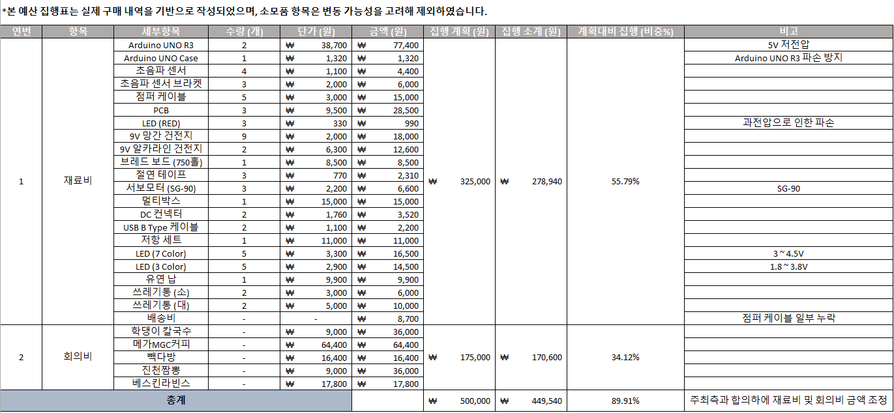
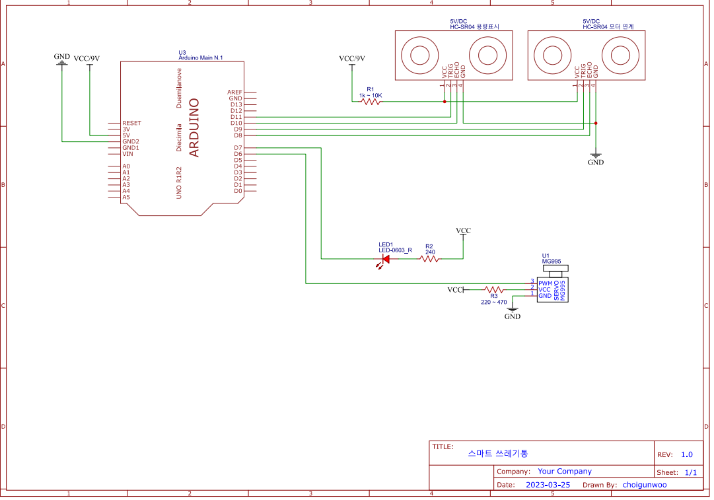

# 스마트 쓰레기통 [캡스톤 디자인 팀 프로젝트]

[0. 팀원](#0-기간-및-팀-구성원)  
[1. 개요](#1-개요)  
[2. 예산 집행 계획 및 소계](#2-예산-집행-계획-및-소계)  
[3. 회로 설계도](#3-회로-설계도)  
[3.2 개발 과정](#32-개발-과정)  
[4. 부품 데이터 도면](#4-부품-데이터-도면)  

## 0. 기간 및 팀 구성원

사전 팀 구성 기간 : `2023. 02. 01. ~ 30.`  
프로젝트 진행 기간 : `2023. 03. 01. ~ 06. 30.`

팀장 / 개발 : `최건우`  
제작 : `2명`  
회계 : `1명`

> [!NOTE]
> 팀원 이름은 외부에 노출되어 문제가 발생할 수 있기에 당시 참여한 팀원들의 포지션과 명수로 표기

## 1. 개요

본 프로젝트는 아두이노 보드, 초음파 센서, LED 색상 지원 기능을 활용하여 사용자에게 편의성과 시각적인 정보를 제공하는 것을 목표로 하였습니다. 기존에 널리 사용되고 있는 부품들을 중심으로 구성함으로써 제작의 효율성과 안정성을 확보하였습니다.
특히, 비접촉 방식의 자동 쓰레기통을 구현함으로써 위생적인 효과를 기대할 수 있으며, 신체 부위를 사용하지 않아도 일정 거리에 진입시 작동되는 구조로 접근성을 높였습니다. 이러한 설계는 시중에 판매 중인 유사 제품들과 비교해 경쟁력을 갖출 수 있다고 판단되어 프로젝트를 진행하게 되었습니다.

## 2. 예산 집행 계획 및 소계



> [!NOTE]
> 본 예산 집행표는 실제 구매 내역을 기반으로 작성되었으며, 소모품 항목은 변동 가능성을 고려해 제외  
> **당시 23년도 03월 01일 부터 06월 30일까지 약 3개월간 지출 내역**

## 3. 회로 설계도



### 3.2 개발 과정

* Arduino UNO R3 보드를 사용하여 저전압인 5V 기준으로 설계 했습니다. 초음파 센서의 Triger는 8번과 10번, Echo는 9번과 11번으로 지정

  ```c
  #include <Servo.h>

  #define triggerPin1 8
  #define echoPin1 9
  #define triggerPin2 10
  #define echoPin2 11
  ```

* 기본 Default 통신 넘버링인 9600번을 할당하여 각 `pinMod`를 통한 시리얼 통신을 연결하고 두 개의 초음파 센서의 Triger과 Echo의 입출력 방식을 지정

  ```c
  void setup() {
      Serial.begin(9600);
      pinMod(triggerPin1, OUTPUT);
      pinMod(echoPin1, INPUT);
      pinMod(triggerPin2, OUTPUT);
      pinMod(echoPin2, INPUT);
  }

  void loop() {
    //...
  }
  ```

* 초음파 센서의 거리 측정 모니터링

  ```c
  //...

  duration = pulseIn(echoPin1, HIGH);
  distance = (duration / 2) / 58.8;
  Serial.print("Distance 1: ");
  Serial.print(distance);
  Serial.println(" cm")

  //...

  duration = pulseIn(echoPin2, HIGH);
  distance = (duration / 2) / 58.8;
  Serial.print("Distance 2: ");
  Serial.print(distance);
  Serial.println(" cm");

  //...
  ```

## 4. 부품 데이터 도면


## 5. 테스트 계획

* 사용자 및 내부 용량 인식 테스트
  * **1 Set당 20번의 거리 측정 인식 테스트를 10초 간격으로 수행**  
  * **1 Set가 종료되면 2분간 대기하고 다음 Set 반복 진행**

* 안전성 테스트
  * **서보 모터의 내구성 확인을 위해 배터리를 교체하며 1000번의 반복 수행**
  * **서보 모터의 작동 여부를 확인하며, 반복 수행에 대한 적합성을 확인**
  * **LED가 On 상태에서부터 시작하여 10분 간격으로 측정하고, 최대 지속가능한 시간을 측정을 위해 On 상태를 유지**

### 5.2 테스트 결과

* 사용자 및 내부 용량 인식 테스트 결과
  * 사용자 인식 테스트 에서는 5 Set와 10 Set에 수행 하던 도중 배터리의 방전으로 작동 불가
  * 서보 모터와 LED 기능 구동 시 하나의 기능이 작동하지 않아 저전압 특성으로 파악

* 반복 수행 안전성 테스트 결과
  * 서보 모터와 LED의 반복 수행 테스트에서 별도의 문제는 발생하지 않았지만 배터리의 수명이 한계에 도달함 으로써 이를 보안할 방법을 모색

## 6. 개선 사항

현재 프로젝트 개발 및 제작을 진행하면서 테스트 결과에 따른 개선 사항을 모색한 결과 배터리의 최대 지속 가능한 시간은 3시간 범위에서 한계를 도달하게 됐기에, 현재 시중에 판매 중인 제품들을 확인하면 개월 단위로 지속가능한 방식을 개발되었기에 향후 배터리외 다른 방법으로 전원을 공급해야 된다고 생각합니다. 또한 Arduino 보드로 부터 점퍼 케이블 연결시 단자와의 접촉 부분이 외부 충격으로 부터 파손 및 혹은 문제를 발생할 확률이 있다고 판단되어 당시 브레드 보드에 연결을 했지만, PCB 회로 기판으로 변경하여 내구성에 대한 개선을 목표로 해야될거 같습니다.
